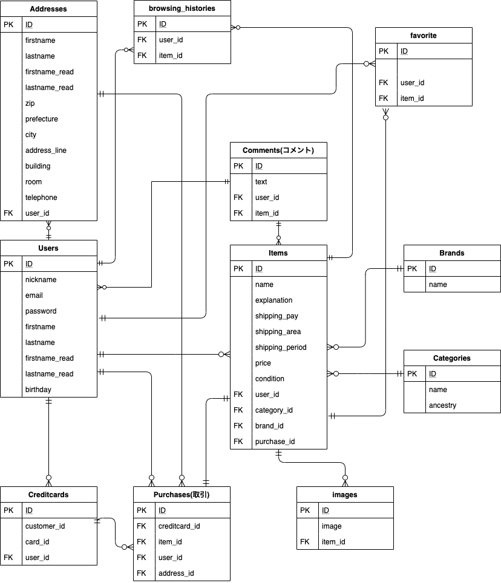

# アプリ概要

ユーザが自由に出品、購入ができるフリーマーケットアプリです。

# 使用技術・言語

- フロントエンド(javascript, jQuery, HTML/CSS, HAML, Sass)
- バックエンド(Ruby on Rails, 外部 API)
- テスト(Rspec)
- web サーバ(nginx, unicorn)
- データベース(MySQL)
- AWS(VPC, EC2, S3)
- 開発環境(VScode, Git, GitHub, Capistrano)

# 機能一覧

- 商品出品・編集(Carriewave, enum, 画像プレビュー, 詳細カテゴリの動的表示)
  　　　　　　　　　　　　　　　　　　担当：井本・加藤
- 商品購入(API)　　　　　　　　　　　担当：井本
- 商品検索(ransack, キーワード + 条件検索)
  　　　　　　　　　　　　　　　　　　担当：加藤
- 商品閲覧(拡大画像の切替)　　　　　 担当：塩見、加藤、福元
- 商品削除　　　　　　　　　　　　　　担当：加藤
- クレジットカード登録(API)　　　　　担当：井本
- ユーザ・住所登録 　　　　　　　　　担当：井本、森川
- ユーザ認証　　　　　　　　　　　　　担当：井本
- コメント　　　　　　　　　　　　　　担当：佐藤、加藤
- お気に入り機能　　　　　　　　　　　担当：塩見
- マイページ　　　　　　　　　　　　　担当：佐藤
- 購入履歴一覧　　　　　　　　　　　　担当：加藤
- 販売商品一覧　　　　　　　　　　　　担当：加藤
- 売却商品一覧　　　　　　　　　　　　担当：加藤
- 閲覧履歴一覧　　　　　　　　　　　　担当：加藤
- 商品ランダム表示(注目のアイテム)　 担当：加藤
- カテゴリ機能(ancestry)　　　　　　担当：井本、福元
- ブランド機能　　　　　　　　　　　　担当：井本、福元
- 無限スクロール　　　　　　　　　　　担当：塩見、加藤
- パンくずナビゲーション　　　　　　　担当：井本
- rspec によるモデルテスト　　　　　担当：井本、加藤
- エラーハンドリング　　　　　　　　　担当：井本、森川、塩見
- データベース　　　　　　　　　　　　担当：井本、加藤、佐藤
- AWS 本番環境　　　　　　　　　　　担当：福元
- 自動デプロイ　　　　　　　　　　　　担当：福元、井本

# table_setting

## ER diagram

## users

### table

| column         | type   | option                    |
| -------------- | ------ | ------------------------- |
| nickname       | string | null: false               |
| email          | string | null: false, unique: true |
| password       | string | null: false               |
| firstname      | string | null: false               |
| lastname       | string | null: false               |
| firstname_read | string | null: false               |
| lastname_read  | string | null: false               |
| birthday       | date   | null: false               |

### association

- has_many :addresses, dependent: :destroy
- has_many :creditcards, dependent: :destroy
- has_many :items, dependent: :destroy
- has_many :purchases, dependent: :destroy
- has_many :browsing_histories, dependent: :destroy
- has_many :comments

## addresses

### table

| column         | type    | option                         |
| -------------- | ------- | ------------------------------ |
| firstname      | string  | null: false                    |
| lastname       | string  | null: false                    |
| firstname_read | string  | null: false                    |
| lastname_read  | string  | null: false                    |
| zip            | integer | null: false                    |
| prefecture     | string  | null: false                    |
| city           | string  | null: false                    |
| address_line   | string  | null: false                    |
| building       | string  |                                |
| room           | string  |                                |
| telephone      | integer |                                |
| user_id        | integer | null: false, foreign_key: true |

### association

- belongs_to :user
- has_many :purchases

## creditcards

### table

| column      | type    | option                         |
| ----------- | ------- | ------------------------------ |
| customer_id | string  | null: false                    |
| card_id     | string  | null: false                    |
| user_id     | integer | null: false, foreign_key: true |

### association

- belongs_to :user
- has_many :purchases

## items

### table

| column          | type    | option                         |
| --------------- | ------- | ------------------------------ |
| name            | string  | null: false                    |
| explanation     | text    | null: false                    |
| price           | integer | null: false                    |
| shipping_pay    | integer | null: false, default: 0        |
| shipping_area   | integer | null: false, default: 0        |
| shipping_period | integer | null: false, default: 0        |
| condition       | integer | null: false, default: 0        |
| image           | string  | null: false                    |
| status          | string  | null: false, default: 0        |
| user_id         | integer | null: false, foreign_key: true |
| category_id     | integer | null: false, foreign_key: true |
| brand_id        | integer | foreign_key: true              |
| purchase_id     | integer | null: false, foreign_key: true |

### association

- belongs_to :user
- belongs_to :purchase
- belongs_to :category
- belongs_to :brand
- has_many :images, dependent: :destroy
- has_many :browsing_histories, dependent: :destroy
- has_many :comments

## images

### table

| column  | type    | option                         |
| ------- | ------- | ------------------------------ |
| image   | string  | null :false                    |
| item_id | integer | null: false, foreign_key: true |

### association

- belongs_to :item

## categories

### table

| column   | type   | option      |
| -------- | ------ | ----------- |
| name     | string | null: false |
| ancestry | string |             |

### association

- has_many :items

## brands

### table

| column | type   | option      |
| ------ | ------ | ----------- |
| name   | string | null: false |

### association

- has_many :items

## comments

### table

| name    | type    | option                         |
| ------- | ------- | ------------------------------ |
| text    | text    | null: false                    |
| user_id | integer | null: false, foreign_key: true |
| item_id | integer | null: false, foreign_key: true |

### association

- belongs_to :user
- belongs_to :item

## purchases

### table

| name          | type    | option                         |
| ------------- | ------- | ------------------------------ |
| item_id       | integer | null: false, foreign_key: true |
| user_id       | integer | null: false, foreign_key: true |
| address_id    | integer | null: false, foreign_key: true |
| creditcard_id | integer | null: false, foreign_key: true |

### association

- belongs_to :user
- belongs_to :item
- belongs_to :address
- belongs_to :creditcard

## favorites

### table

| column   | type    | option      |
| -------- | ------  | ----------- |
| user_id  | intenger| null: false |
| item_id  | intenger| null: false |

### association

- belongs_to :user
- belongs_to :item

## browsing_histories

### table

| name    | type    | option                         |
| ------- | ------- | ------------------------------ |
| item_id | integer | null: false, foreign_key: true |
| user_id | integer | null: false, foreign_key: true |

### association

- belongs_to :user
- belongs_to :item
